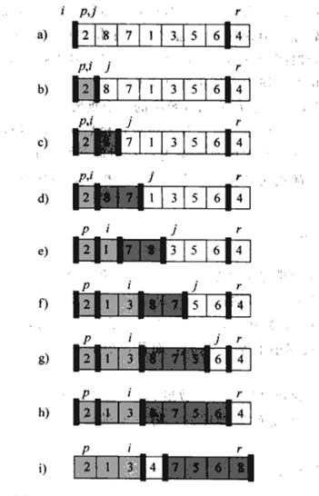

## 第三章作业

1. 以下是快速排序中的一种PARTITION方法的伪代码及过程：

仿照上图说明PARTITION过程作用于数组$A=<13,19,9,5,12,4,7,8>$的过程。

 

 

 

 

 

2. 以下图为模型，说明合并排序在输入数组$A = <3,41,52,26,38,57,9,49>$上的执行过程。

 

3. 假设A和B是长度为n排好序的数组，且数组中每个数都是不同的。

   1. 设计一个算法，在$O(\log n)$时间里找出这2n个数的中位数，其中2n个数的中位数为从小到大排序的第n个数。

      基本思想：在归并排序算法上优化。

      设 C 为 A、B 归并排序结果，容易知道所求中位数为 $(C[n] + C[n+1]) / 2$；而求 $C[n]$ ，可以先设 $A$ 中取了 $x$ 个数，那么 $B$ 中取了 $n - x$ 个数，$C[n] = \min(A[x], B[n - x])$，然后可以使用二分法找到合适的 $x$ 值。（设$A$、$B$下标为$[0\dots(n-1)]$。）

      
      $$
      \begin{align*}
      & FIND\_N\_IN\_C(A, B, l_a, l_b, n) \\
      & \text{// 让 B 始终比 A 长} \\
      & 1.\ \textbf{if} \ l_a > l_b \\
      & 2.\ \qquad \textbf{then} \ \textbf{return} \ FIND\_N\_IN\_C(B, A, l_b, l_a, n) \\
      & \text{// 处理空串} \\
      & 3.\ \textbf{if} \ l_a = 0 \\
      & 4.\ \qquad \textbf{then} \ \textbf{return} \ B[0] \\
      & \text{// 递归边界条件} \\
      & 5.\ \textbf{if} \ n = 1 \\
      & 6.\ \qquad \textbf{then} \ \textbf{return} \ \min(A[0], B[0]) \\ 
      & 7.\ n_a \leftarrow \min(\lfloor n / 2 \rfloor , l_a) \\
      & 8.\ n_b \leftarrow n - n_a \\
      & 9.\ \textbf{if} \ A[n_a - 1] < B[n_b - 1] \\
      & 10. \qquad \textbf{then} \ \textbf{return} \ FIND\_N\_IN\_C(A[n_a\dots (n-1)], B, l_a - n_a, l_b - n_b, n - n_a) \\
      & 11. \qquad \textbf{else} \ \textbf{return} \ FIND\_N\_IN\_C(A, B[n_b\dots (n-1)], l_a, l_b - n_b, n - n_b) \\
      \\
      
      & FIND\_MEDIUM(A, B, n) \\
      & 1.\ \textbf{return} \ (FIND\_N\_IN\_C(A, B, n, n, n) + FIND\_N\_IN\_C(A, B, n, n, n + 1)) / 2 \\
      \end{align*}
      $$
      

      
   2. 证明你的算法复杂度为$O(\log n)$。

      证明：
      $$
      \begin{align*}
      T(n) 
      & = FIND\_N\_IN\_C(A, B, l_a, l_b, n) \\
      & = \Theta(FIND\_N\_IN\_C(A, B, l_a, l_b, \frac{n}{2})) + \Theta(1) \\
      & = T(\frac{n}{2}) + \Theta(1) \\
      \end{align*}
      $$

      $$
      \because Master 定理 \ \therefore T(n) = \Theta(n^{\log_21} \log n) = \Theta(\log n)
      $$

      

 

4. n枚硬币，其中有一枚是假币，己知假币的重量较轻。现只有一个天平，要求用尽量少的比较次数找出这枚假币。我们用$f(A,first,last)$函数来完成上述功能。请写出该函数的伪代码 (其中A表示硬币数组$[1\dots n]$，$first$，$last$为当前考虑的硬币数组中的第一个和最后一个下标，函数返回值为假币的下标)。

   基本思想：把目标硬币堆分作两份，假币一定在轻的那一份中；二分查找直到当前堆中硬币数为 0 或者 1。
   $$
   \begin{align*}
   & f(A, first, last) \\
   & \text{// 终止条件(当前硬币堆有1或者0个硬币)} \\
   & 1.\ \textbf{if} \ first = last \\
   & 2.\ \qquad \textbf{then} \ \textbf{return} \ first \\
   & 3.\ \textbf{if} \ last = first - 1 \\
   & 4.\ \qquad \textbf{then} \ \textbf{if} \ A[first] < A[last] \\
   & 5.\ \qquad \qquad \qquad \textbf{then} \ \textbf{return} \ first \\
   & 6.\ \qquad \qquad \textbf{else} \ \textbf{return} \ last  \\
   
   & 7.\ mid \leftarrow (first + last) / 2 \\
   & 8.\ left \leftarrow f(A,first, mid) \\
   & 9.\ right \leftarrow f(A, mid + 1, right) \\
   & 10.\ \textbf{if} \ A[left] < A[right] \\
   & 11.\ \qquad \textbf{then} \ \textbf{return} \ left \\
   & 12.\ \textbf{else} \ \textbf{return} \ right \\
   \end{align*}
   $$
   

 

5. 假设给定一个**不同**整数组成的已经排好序的数组`A[1,...,n]`,我们需要在该数组中查找是否存在索引`i`，使得`A[i]=i`。

   1. 尝试用描述分治算法来解决该问题。要求写出伪代码。

      因为`A[1...n]`已经排好序，所以对$\forall k \in [1,n]$，当$A[k] < k$，则$i > k$；当$A[k] > k$，则$i < k$；当$A[k] = k$，则$i=k$。
      $$
      \begin{align*}
      & FIND\_INDEX(A, first, last) \\
      & 1.\ \textbf{if} \ A[first] = first\\
      & 2.\ \qquad \textbf{then} \ \textbf{return} \ first \\
      & 3.\ \textbf{if} \ A[last] = last \\
      & 4.\ \qquad \textbf{then} \ \textbf{return} \ last \\
      & 5.\ k \leftarrow (first + last) / 2 \\
      & 6.\ \textbf{if} \ A[k] < k \\
      & 7.\ \qquad \textbf{then} \ \textbf{return} \ FIND\_INDEX(A, k, last) \\
      & 8.\ \textbf{else} \ \textbf{return} \ FIND\_INDEX(A, first, k) \\
      & // FIND\_INDEX(A, 1, n) \text{即为所求。} \\
      \end{align*}
      $$
      

   2. 使用主定理估计第（1）小题中你所描述算法的复杂度。（注意：给出的算法应当保证在$O(\lg n)$的运行时间内）。
      $$
      \begin{align}
      & \because k & = & (first + last) / 2 & \approx n / 2 & \\
      & \therefore T(n) & = & FIND\_INDEX(A,1, n) & & \\
      & & = & FIND\_INDEX(A,1,n/2) & + f(n), & \quad f(n) = \Theta(1) \\
      \end{align}
      $$

      $$
      \begin{align*}
      & \because Master 定理, f(n) = \Theta(n^{\log_2 1}) = \Theta(1) \\
      & \therefore T(n) = \Theta(n^{\log_2 1}\lg n) = \Theta(\lg n) = O(\lg n) \\
      \end{align*}
      $$

      

 